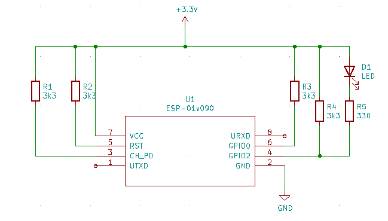

# ESP8266 RTOS Switch

Building
--------

Clone the repository. Start a Docker container containing the SDK and toolchain and mount the code into it using the following command:

```docker run --rm -ti --name esp8266-rtos -v /<PATH TO esp8266-rtos-switch>:/build gazzyt/esp8266-toolchain```

Configure the application. Run ```make menuconfig``` and go to:
* esp8266 RTOS Switch Configuration ->
    1. WiFi HOSTNAME: The hostname that the device will appear as on the network
    1. WiFi SSID: WIFI network to connect to.
    2. WiFi Password: WIFI password

Build the application by running ```make```.

To flash the firmware we could normally run ```make flash```.

If the docker container is running under WSL2 then the serial port is not available so we have to flash from Windows:

```python -m esptool --chip esp8266 --port COM6 write_flash --flash_size 512KB 0 \\wsl$\Ubuntu-20.04\<PATH TO esp8266-rtos-switch>\build\bootloader\bootloader.bin 0x10000 \\wsl$\Ubuntu-20.04\<PATH TO esp8266-rtos-switch>\build\esp8266-rtos-switch.bin 0x8000 \\wsl$\Ubuntu-20.04\<PATH TO esp8266-rtos-switch>\build\partitions_singleapp.bin```

Reset the device and check the debugging output from the serial monitor. Point a browser at ```http://<hostname>``` and use the on off buttons. The buttons switch the state of the GPIO2 pin which can be used to drive an LED etc.

An example circuit:
